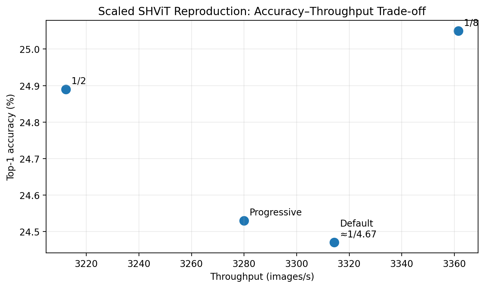

# Experimental Results

This directory contains the outputs of a scaled reproduction of the partial-channel attention ablation from **SHViT: Single-Head Vision Transformer with Memory Efficient Macro Design**, together with a stage-wise attention-allocation extension.

## Setup

- Dataset: CIFAR-100
- Backbone: SHViT-S1
- Input resolution: 224 × 224
- Epochs: 10
- Batch size: 64
- Optimizer: AdamW
- Learning-rate scheduler: cosine
- Training environment: Google Colab GPU
- Efficiency metric: inference throughput (images/s)
- Accuracy metrics: Top-1 and Top-5

The original paper trains on ImageNet-1K for 300 epochs, so this experiment is intended to reproduce the **relative behavior of the architectural variants**, not the paper's absolute ImageNet accuracy or A100 throughput values.

## Final Results

| Variant | Top-1 | Top-5 | Parameters | Throughput |
|---|---:|---:|---:|---:|
| 1/8 | **25.05%** | 55.62% | 6,012,788 | **3361.52 img/s** |
| Default ≈1/4.67 | 24.47% | 54.85% | 6,041,908 | 3314.32 img/s |
| 1/2 | 24.89% | **55.68%** | 6,213,524 | 3212.21 img/s |
| Progressive | 24.53% | 54.79% | 6,045,524 | 3279.95 img/s |

## Interpretation

The throughput ordering follows the expected efficiency trend: increasing the number of channels processed by SHSA reduces inference throughput.

The accuracy ordering did not exactly match the original paper. Within this short CIFAR-100 training regime, the 1/8 configuration achieved the highest Top-1 accuracy. Because all runs used only 10 epochs and one seed, the small accuracy differences should not be considered conclusive evidence about the optimal partial ratio.

The progressive extension redistributed approximately the same attention-channel budget toward Stage 3. It achieved essentially unchanged Top-1 accuracy relative to the default configuration but slightly lower throughput, providing no evidence of a better accuracy-efficiency trade-off in this setting.

## Files

- `accuracy.csv` — best validation metrics for each training run
- `throughput.csv` — inference benchmark results
- `ratio_1_8/log.txt` — 1/8 partial-ratio training log
- `ratio_default/log.txt` — default SHViT ratio training log
- `ratio_1_2/log.txt` — 1/2 partial-ratio training log
- `progressive/log.txt` — stage-wise extension training log